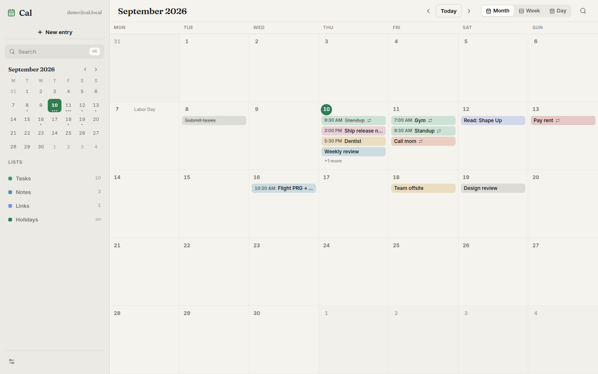
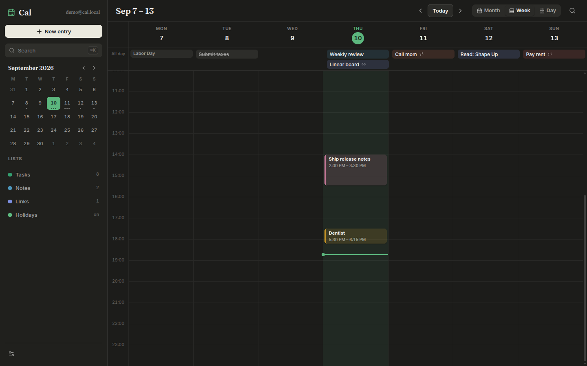

# Cal

The self-hosted daily toolkit people actually enjoy opening.

[](https://github.com/Dvorinka/cal/actions/workflows/ci.yml)
[](https://github.com/Dvorinka/cal/releases)
[](LICENSE)

**[calhq.vercel.app](https://calhq.vercel.app)** — landing page

Calendar, tasks, notes, links, files, kanban boards, time tracking and a GitHub
inbox in one quiet place. No accounts on someone else's server — one
`docker run` and it's yours.




## Quickstart

```bash
docker run -d --name cal -p 8080:8080 -v cal-data:/data ghcr.io/dvorinka/cal:latest
```

Open http://localhost:8080 and create your account. UI, API and an embedded
Postgres all run in that one container; the `cal-data` volume is the only thing
to back up. Prefer your own database? Set `DATABASE_URL` and the embedded one
stays off.

Desktop apps (Windows/Linux/macOS), headless `cal-server` binaries and an
Android APK attach to every
[release](https://github.com/Dvorinka/cal/releases). The desktop app bundles its
own server, or can sign in to a server URL to share data between devices.

## What you get

- **Planner core** — month, week and day views with drag-and-drop, recurring
  tasks, natural-language quick add (`dentist fri 5pm #health`), reminders,
  per-entry version history, soft-delete trash
- **Beyond the calendar** — notes with templates and `[[wikilinks]]`, a link
  library that unfurls titles/thumbnails and searches YouTube via your own
  Invidious instance, file uploads with public share links, kanban boards
  with WIP limits and read-only public sharing
- **Portable** — full JSON export one click away, or a zip that packs every
  upload binary too; restores merge additively, and the server writes
  nightly snapshots for 14 days
- **Time & people** — focus timer with pomodoro mode, billable sessions with
  hourly rates and CSV/JSON export; a private relationship manager whose
  birthdays, anniversaries and namedays surface on the calendar
- **Sync & feeds** — two-way CalDAV, read-only Google Calendar, iCalendar feed
  subscriptions, CardDAV birthdays, RSS/Atom items on their publish date,
  holidays for 40+ regions
- **Automation** — GitHub inbox (issues/PRs become cards, status flows both
  ways), HMAC-signed webhooks out, email-to-task intake, `.ics` import/export,
  and a token-gated MCP endpoint so AI assistants can drive your planner
- **Everywhere** — offline-first PWA with a write queue, Android shell with a
  home-screen widget, Wails desktop app, share-target integration, global
  `⌘K` palette, keyboard-first navigation. The Android app can also run
  **serverless**: local mode keeps only Mail and dials your IMAP/SMTP
  provider directly from the device — accounts stay encrypted on-device and
  can be imported to a server if you set one up later
- **Contained** — cookie sessions, bcrypt passwords, login rate limiting,
  AES-256-GCM for stored credentials, SSRF-guarded outbound URLs, zero
  external services required

## Stack

React 19 + Vite + TypeScript + Tailwind 4 + Zustand · Go + Gin + PostgreSQL
(pgx, Goose migrations) · Wails 2 desktop · Capacitor shells · one Docker
image for everything. API contract lives in `openapi.yaml`; the typed TS
client in `packages/api-client` is kept in sync with it.

```
apps/web         React PWA + Capacitor android/ios shells
apps/api         Go API + migrations + MCP endpoint
apps/desktop     Wails app; `-tags headless` is the all-in-one server
packages/api-client   shared typed client
```

## Configuration

| Variable | Default | Purpose |
| --- | --- | --- |
| `PORT` | `8080` | listen port |
| `DATA_DIR` | `/data` (container) | files, backups, embedded PG data |
| `DATABASE_URL` | unset → embedded PG | external Postgres DSN |
| `SESSION_SECURE` | `false` | set `true` behind HTTPS |
| `WEB_ORIGIN` | unset | extra CORS origin for the web app |
| `GOOGLE_CLIENT_ID` / `GOOGLE_CLIENT_SECRET` | unset | enable Google Calendar sync |
| `CAL_ALLOW_PRIVATE_FEEDS` / `CAL_ALLOW_PRIVATE_WEBHOOKS` | unset | allow private/LAN URLs (SSRF guard off) |

## Development

```bash
npm install
cp apps/api/.env.example apps/api/.env

# Postgres (or uncomment the db service in docker-compose.yml)
docker run -d --name cal-db -e POSTGRES_DB=cal -e POSTGRES_USER=cal \
  -e POSTGRES_PASSWORD=cal -p 5432:5432 postgres:16-alpine

npm run dev -w @cal/web              # vite on :5173, proxies /api
cd apps/api && go run ./cmd/server   # api on :8080
```

Verify before opening a PR:

```bash
npm run typecheck && npm run test && npm run build
cd apps/api && go vet ./... && go test ./...
```

E2E: `cd apps/web && npx playwright test` (Playwright + axe).
Load: `k6 run perf/k6.js -e EMAIL=… -e PASS=…`.

## Docs

- [`openapi.yaml`](openapi.yaml) — full API schema; session-cookie auth, bearer
  tokens for MCP/intake/widget/feed endpoints
- [`docs/releasing.md`](docs/releasing.md) — how releases build, code-signing
  secrets
- [`ROADMAP.md`](ROADMAP.md) · [`CONTRIBUTING.md`](CONTRIBUTING.md) ·
  [`SECURITY.md`](SECURITY.md)

## License

MIT — see [`LICENSE`](LICENSE).
